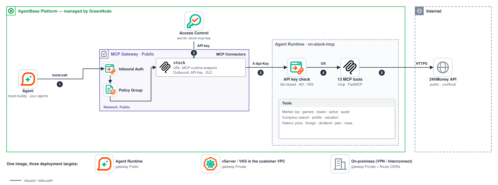
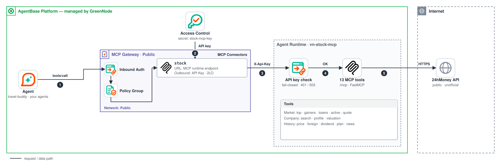

# VN Stock MCP Server — GreenNode AgentBase sample

> **A pure MCP server** (not an agent): no LLM, no memory, no chat.
> Deploy it as an **Agent Runtime** on AgentBase and register it as an **MCP Connector**
> in **MCP Gateway**. Every agent on the gateway (as permitted by a Policy Group) can then call
> the 13 Vietnamese stock-market tools through the gateway.
>
> The same image can run in **three places** — Agent Runtime, vServer/VKS inside the customer's VPC,
> or on-prem. See [Deploy in three places](#deploy-in-three-places).

[](https://github.com/GreenNode-Samples/sample-mcp-stock-server/actions/workflows/ci.yml)
[](LICENSE)

## Architecture



The same image runs in three places, and only the gateway's network mode and the connector URL change:

- **(a) Agent Runtime on AgentBase**: a **Public** MCP Gateway calls the runtime's public endpoint, which is protected by
  the fail-closed API key and the runtime's IP Access Control.
- **(b) vServer / VKS in your VPC**: a **Private** gateway reaches the server's private IP over the private connection
  between the AgentBase VPC (`172.30.0.0/16`) and your VPC.
- **(c) On-premises**: a **Private** gateway with **Route CIDRs** for the on-premises range goes through your VPC and
  VPN Site-to-Site / Interconnect to the data center.

In every case the server calls the public 24hMoney API, so (b) and (c) need outbound HTTPS through NAT or a proxy
(or an internal mirror set in `STOCK_API_BASE_URL`). The call flow inside the gateway is shown in
[End-to-end flow](#end-to-end-flow); the per-option settings are in [Deploy in three places](#deploy-in-three-places).

## Why does this repo exist?

GreenNode AgentBase infrastructure does not only run *agents*. **Agent Runtime** can run
**any MCP server** as a dedicated runtime. This is the "tool provider" model:

```
 Agent (LLM + Memory)
        │  tools/call (MCP JSON-RPC) + the agent's IAM/JWT token
        ▼
 ┌──────────────────────────────────────────────────────────────┐
 │ MCP Gateway                                                  │
 │  ① Inbound Auth (IAM / JWT) — authenticates the agent        │
 │  ② Policy Group — may this agent call stock__<tool>?         │
 │  ③ MCP Connector `stock` — Outbound Auth = API Key           │
 │     (key from Access Control, attached as X-Api-Key header)  │
 └──────────────────────────────┬───────────────────────────────┘
                                │  POST /mcp  + X-Api-Key
                                ▼
 ┌──────────────────────────────────────────────────────────────┐
 │ Agent Runtime: this repo (NO LLM)                            │
 │  Security Settings (IP Access Control · Inbound Identity)    │
 │  → middleware validates the API key (fail-closed) → 13 tools │
 └──────────────────────────────┬───────────────────────────────┘
                                ▼
                       24hMoney (public, unofficial API)
```

- **Agent** = the component that *thinks* (LLM + memory) and calls tools through the gateway.
- **MCP server** (this repo) = the component that *holds the data*. Any agent can call it without
  knowing where the server runs; the gateway manages the credential, and the agent never sees the API key.

## Tools (13)

Every tool returns a JSON **object** (MCP structured output: `structuredContent`, with the same JSON as text in `content`).
A failure is a normal MCP tool error: the result has `isError: true` and a short, readable message in `content` (for
example `Invalid stock symbol: 'x'...` or `24hMoney API is unavailable (HTTP 503) after 3 attempts`). Error messages never
contain the upstream URL. All tools are annotated `readOnlyHint` and `openWorldHint`.

Common result conventions:

- `source` (`"24hmoney.vn"`) is at the top level of every result; `units` is at the top level of every result that contains numbers.
- Every list result has a `count`. Missing upstream values are `null`, never `0`.
- Dates are `YYYY-MM-DD` (trading days in Vietnam time); timestamps are ISO 8601 with the `+07:00` offset.
- Limits (`limit`, `days`) are clamped to the documented range instead of being rejected.

### Market

Shared source `top-stock-all` (~90 most liquid symbols), cached for 60s.

| Tool | Description |
|---|---|
| `market_top_stocks(limit, sort)` | Table of ~90 top market symbols. `sort`: `default` / `change_percent` / `value` / `volume` / `foreign_net_buy` |
| `top_gainers(limit)` | Top symbols with the largest **gains** (positive % only) |
| `top_losers(limit)` | Top symbols with the deepest **losses** (negative % only) |
| `most_active(limit)` | Top symbols by **liquidity** (traded value) |
| `stock_quote(symbol)` | Quote for one symbol in the top group: price, +/-%, ceiling/floor, matched volume & value, foreign buy/sell |

Market results also include `stocks_tracked`, `last_update` (ISO 8601, Vietnam time) and a `note` when the data is
more than 15 minutes old (market closed). `state` is one of `up`, `down`, `unchanged`, `at_ceiling`, `at_floor`, `unknown`.

### Companies

Applies to every symbol listed on HOSE · HNX · UPCOM (~1.6k companies). `symbol` accepts only `A–Z`, `0–9`, 2–10 characters.

| Tool | Description |
|---|---|
| `search_company(query, limit)` | Find a symbol by name / ticker (`limit` 1–30, default 10), accent- and case-insensitive. Ranking: ticker match → name match, then larger companies first (`priority`), exchange order HOSE > HNX > UPCOM |
| `company_profile(symbol)` | Full name (VN/EN), listing exchange, business description |
| `price_history(symbol, days)` | Per trading session (newest first): close, reference, +/-%, volume, value. `days` = number of trading sessions (≤ 30). The summary reports `highest_close` / `lowest_close` (closing prices, not intraday highs/lows) and the % change from the oldest session's reference price to the latest close |
| `foreign_trading(symbol, days)` | Daily foreign buy/sell and net value (`days` = trading sessions, ≤ 25). Missing values stay `null` and are left out of the net and the `net_buy` / `net_sell` / `balanced` trend |
| `valuation(symbol)` | P/E, P/B, ROE, ROA, EPS, etc. compared with the industry average |
| `dividend_history(symbol, limit)` | Dividend history (`cash` / `stock` / `bonus_shares`), newest first |
| `business_plan(symbol)` | Annual business plan and % completion |
| `company_announcements(symbol, limit)` | Corporate disclosures (with PDF links), `limit` ≤ 20 |

### Data source and disclaimer

Data comes from the public APIs used by the [24hMoney](https://24hmoney.vn) web/app
(`api-finance-t19.24hmoney.vn`) and requires no API key. This is an **unofficial API**
and may change or be blocked at any time.

> **For demo/sample use only.** This is not investment advice and must not be used for real
> trading. Data may be delayed or inaccurate.

**Units:** stock prices are in **thousand VND**; traded value is in **billion VND**; volumes are in shares. Each result
states the units it uses in its `units` object.

## Repo structure

```
├── Dockerfile                # image: python:3.12-slim, non-root (uid 10001), port 8080, /health
├── requirements.txt          # runtime dependencies (bounded)
├── requirements-dev.txt      # + pytest, pytest-asyncio, ruff, pyyaml
├── .env.example              # sample environment variables
├── deploy/                   # deployment outside Agent Runtime (not in the image)
│   ├── vserver/              #   docker compose on vServer (+ optional Caddy TLS override)
│   ├── vks/                  #   Kubernetes manifests for VKS (NodePort, internal only)
│   └── onprem/               #   on-prem docker compose + check_connectivity.sh
├── src/mcp_server/main.py    # the entire server (single file)
└── tests/                    # hermetic tests (no network calls)
```

## Run locally

```bash
export KEY=$(openssl rand -hex 32)          # API key for this run

docker build -t stock-mcp-server .
docker run --rm -p 8080:8080 -e MCP_API_KEYS="$KEY" stock-mcp-server

# health — always open, no key required
curl -s http://localhost:8080/health      # {"status":"ok","tools":13}
```

The MCP endpoint is exactly `http://localhost:8080/mcp`; `/mcp/` (trailing slash) is **not** redirected and returns 404,
so use the URL without the trailing slash in every connector / client.

Call a tool with an MCP client (Python), passing the key in the `X-Api-Key` header:

```bash
pip install mcp
KEY=$KEY python - <<'PY'
import asyncio, os
from mcp import ClientSession
from mcp.client.streamable_http import streamablehttp_client

KEY = os.environ["KEY"]

async def main():
    async with streamablehttp_client(
        "http://localhost:8080/mcp", headers={"X-Api-Key": KEY}
    ) as (r, w, _):
        async with ClientSession(r, w) as s:
            await s.initialize()
            tools = await s.list_tools()
            print([t.name for t in tools.tools])
            res = await s.call_tool("search_company", {"query": "hoa phat"})
            print(res.content[0].text)

asyncio.run(main())
PY
```

Run without Docker (Python 3.11+): `pip install -r requirements.txt && MCP_API_KEYS=$KEY python src/mcp_server/main.py`.

## Authentication

There are **two independent layers of protection**; enable both for real deployments.

### Layer 1: application-level API key (fail-closed)

The server validates the API key on the `/mcp` endpoint itself:

| Item | Behavior |
|---|---|
| Configuration | The `MCP_API_KEYS` environment variable, a comma-separated list of keys |
| Accepted headers | `X-Api-Key: <key>` · `Authorization: Bearer <key>` |
| Key requirements | At least **32 characters** and not a placeholder (a key containing `<`, `>` or `change-me` is rejected) → use `openssl rand -hex 32` |
| **Invalid key configured** | `503` + an error in the startup log naming the problem — one bad entry rejects the whole list, so a leftover placeholder never becomes a working key |
| Key configured but caller's key is missing/wrong | `401` with `WWW-Authenticate` (constant-time comparison) |
| **No key configured** | `503` — the server **never opens itself up** (fail-closed) |
| `/health`, `/` | Always open (so the runtime can health-probe); `/health` returns only `{"status":"ok","tools":13}` |

**Key rotation:** keys are read **once at startup**, so every change needs a restart / redeploy of the runtime.
Set two keys at the same time, `MCP_API_KEYS="old_key,new_key"` (restart) → update the key on the
calling side (Access Control / connector) to `new_key` → remove `old_key` from the environment variable (restart).
No downtime as long as the restarts are rolling.

**`ALLOW_ANONYMOUS=true`** is only for local runs when you do not want to set a key (`/mcp` is then fully open if
`MCP_API_KEYS` is empty). **Never use it in a deployed environment.** If a key is configured,
the key is still required even when `ALLOW_ANONYMOUS=true`; an invalid key (placeholder / too short) keeps `/mcp` locked.

### Layer 2: Agent Runtime Security Settings (platform level)

Configured when you create the Agent Runtime in the console (see the
[Create runtime documentation](https://docs.greennode.ai/ai-stack/agent-base/agent-runtime/create-runtime)).
These settings block requests **before** they reach the container:

- **IP Access Control** — the list of source CIDRs allowed to call the runtime endpoint
  (for example, only the MCP Gateway egress IP range / the corporate network).
- **Inbound Identity** — how the runtime authenticates callers: `IAM Permissions`, `JWT`,
  or `No authorization`.

> Note: the MCP Gateway connector calls the runtime with an **API Key** (see below), so if you
> enable Inbound Identity on the runtime, choose a mode that is compatible with how the gateway calls in,
> and re-test `tools/list`. Layer 1 (API key) remains the mandatory layer for this sample.

## Deploy to GreenNode AgentBase

> Prerequisites: [IAM credentials](https://aiplatform.console.vngcloud.vn), an image repository
> in **Container Registry** (vCR), and an **MCP Gateway** (see the skills
> `agentbase-deploy` and `agentbase-gateway`).

### 1. Build and push the image to Container Registry

```bash
docker build --platform linux/amd64 -t vcr.vngcloud.vn/<repo>/stock-mcp-server:v1 .
docker push vcr.vngcloud.vn/<repo>/stock-mcp-server:v1
```

### 2. Create the Agent Runtime

Create a runtime from the image above (console or the `agentbase-deploy` skill), with a flavor such as
`runtime-s2-general-2x4`, and set the environment variable:

```bash
export MCP_KEY=$(openssl rand -hex 32)   # RECORD IT — step 3 reuses the same value
                                         # (the server rejects placeholders and keys shorter than 32 characters)

# runtime env:
#   MCP_API_KEYS=<value of $MCP_KEY>
```

When the runtime is `ACTIVE` (a public endpoint is created automatically):

```bash
curl -s https://<endpoint>.agentbase-runtime.aiplatform.vngcloud.vn/health   # → 200, no key required
```

In the runtime's **Security Settings**, set **IP Access Control** (allowed CIDRs) and
choose a suitable **Inbound Identity** (see [Layer 2](#layer-2-agent-runtime-security-settings-platform-level)).

> **About secrets in env:** the AgentBase documentation specifies that runtime environment variables
> are for **non-sensitive** configuration. An API key is a secret, so the proper place to store it is
> **Access Control** (step 3). However, this server *reads its key from the environment variable*
> `MCP_API_KEYS`, so **in this sample we set the same key in both places**: the runtime
> env (so the server can validate it) and Access Control (so the gateway can attach it to requests). This is a
> demo trade-off; for production, rotate keys regularly and restrict who can view the
> runtime configuration.

### 3. Store the key in Access Control

Console → **Access Control** → create an **API Key provider** named `stock-mcp-key` whose value is
**exactly the key** `$MCP_KEY` from step 2 (or use the `agentbase-identity` skill).

### 4. Register the MCP Connector in MCP Gateway

Console → **MCP Gateway** → select the gateway → **Add Custom Connector**:

- **Name**: `stock`
- **Endpoint**: `https://<endpoint>.agentbase-runtime.aiplatform.vngcloud.vn/mcp`
- **Outbound Auth**: **API Key** (flow `2LO` — one shared key for all callers)
  - Header name: `X-Api-Key` (leave prefix empty)
  - Provider: `stock-mcp-key`

Or via the API (JSON Merge Patch — **send the complete desired targets array**):

```bash
# IAM token: client-credentials grant with the client id / secret of your IAM service account
# (the same call as scripts/print_token.py in the sample-byo-agent-mcp-gateway repo)
TOKEN=$(curl -s -u "$GREENNODE_CLIENT_ID:$GREENNODE_CLIENT_SECRET" -d grant_type=client_credentials \
  https://iam.api.vngcloud.vn/accounts-api/v2/auth/token \
  | python3 -c 'import json,sys; print(json.load(sys.stdin)["access_token"])')
curl -X PATCH "https://agentbase.api.vngcloud.vn/gateway/api/v1/gateways/<gw>" \
  -H "Authorization: Bearer $TOKEN" -H "Content-Type: application/json" \
  -H 'If-Match: "<resourceVersion>"' \
  -d '{"targets": [ /* existing targets (keep them!) + */ {
        "name": "stock",
        "type": "MCP",
        "endpoint": "https://<endpoint>.agentbase-runtime.aiplatform.vngcloud.vn/mcp",
        "outboundAuth": {
          "type": "APIKEY",
          "flow": "2LO",
          "headerName": "X-Api-Key",
          "headerValuePrefix": "",
          "providerName": "stock-mcp-key"
        }
  }]}'
```

> **Warning:** `targets` is a **full replacement**. Fetch the current list
> (`GET /gateways/<gw>`) and send all existing connectors as well, otherwise they will be lost.

### 5. Policy Group — who can call which tool?

The tools of the `stock` connector appear on the gateway with actions of the form `stock__<tool>`.
**With no Policy Group attached, every `tools/call` returns `403`** (`tools/list` is always
allowed so that agents can discover tools). Example policy allowing one agent to call all 13 tools:

```json
{
  "effect": "allow",
  "principal": "iam:<agent-id>",
  "actions": [
    "stock__market_top_stocks", "stock__top_gainers", "stock__top_losers",
    "stock__most_active", "stock__stock_quote",
    "stock__search_company", "stock__company_profile", "stock__price_history",
    "stock__foreign_trading", "stock__valuation", "stock__dividend_history",
    "stock__business_plan", "stock__company_announcements"
  ],
  "resources": ["gateway:<gateway-name>"]
}
```

Create a Policy Group containing the policy above and attach it to the gateway (`agentbase-policy` skill).
Do not mix `"*"` with a list of specific actions — choose one or the other.

### End-to-end flow



```
Agent → MCP Gateway (Inbound Auth: IAM/JWT)
      → Policy Group (is stock__<tool> allowed?)
      → Connector `stock` (Outbound Auth: API Key from Access Control)
      → This Agent Runtime (/mcp, validates the API key)
      → 24hMoney
```

No agent code changes are needed: the agent only sees the `stock__...` tools through the gateway and uses its own IAM token.

## Deploy in three places

The **same image** (the Dockerfile at the repo root) can be deployed in three places, matching the three scenarios customers most often ask about.
Agent Runtime and MCP Gateway never run in the customer's VPC: in Public mode they use AgentBase's shared public
endpoint, and in Private mode they run in the GreenNode-managed **AgentBase VPC (`172.30.0.0/16`)**. The **gateway's network mode** therefore determines where it can reach the MCP server.

| | (a) Agent Runtime | (b) vServer / VKS in the customer's VPC | (c) On-prem (data center) |
|---|---|---|---|
| When to use | Fastest; GreenNode manages the infrastructure | The MCP server must not be exposed to the Internet and sits in a private VPC | Data/servers must stay in the data center |
| **Gateway Network mode** | **Public** | **Private** (select the VPC + Subnet of the vServer/VKS) | **Private** + **Route CIDRs** including the on-prem CIDR |
| **Connector URL** | `https://<endpoint>.agentbase-runtime.aiplatform.vngcloud.vn/mcp` | vServer: `http://xx.xx.x.x:8080/mcp` (`https://…:8443/mcp` with the Caddy TLS override) · VKS: `http://<node-private-ip>:30080/mcp` | `http://xx.xx.x.x:8080/mcp` over the VPN / Interconnect (`https://…:8443/mcp` only behind your own TLS proxy) |
| **Outbound Auth** | API Key — header `X-Api-Key`, provider in Access Control | API Key — header `X-Api-Key`, provider in Access Control | API Key — header `X-Api-Key`, provider in Access Control |
| Additional connectivity | — | The VPC must already be privately connected to AgentBase (contact GreenNode support), with DNS resolution enabled; security group allowing `172.30.0.0/16` | Site-to-Site VPN / Interconnect (customer side), bidirectional routes including `172.30.0.0/16`, firewall allowing `172.30.0.0/16` |
| Guide | [Deploy to GreenNode AgentBase](#deploy-to-greennode-agentbase) (above) | [`deploy/vserver/`](deploy/vserver/README.md) · [`deploy/vks/`](deploy/vks/README.md) | [`deploy/onprem/`](deploy/onprem/README.md) |

Notes:

- **The gateway's Network mode is chosen at creation time (step ⑤ Network & Compute) and cannot be changed afterward.** A **Private**
  gateway keeps traffic on the private network, so an MCP server reachable only over the Internet (as in (a)) requires a separate **Public** gateway.
- A Private gateway lists only VPCs that are **already privately connected to AgentBase**; if yours is not listed, contact GreenNode support to enable it.
- The server always calls the public 24hMoney API: on vServer / VKS allow outbound HTTPS through NAT or a proxy, on-premises
  through the data center's proxy / NAT, or point `STOCK_API_BASE_URL` at an internal mirror. See the diagram in
  [Architecture](#architecture).
- In (b) and (c) the URL is plain `http://` unless you add TLS: the traffic stays on the private connection, and the repo ships a TLS option
  only for vServer (`deploy/vserver/docker-compose.tls.yml`). The connector URL is always exactly `/mcp` (no trailing slash).
- Wherever the server runs, **the Policy Group still uses the same `stock__<tool>` actions** (e.g. `stock__search_company`).
  Only the connector's Endpoint changes; there is no need to rewrite policies or agent code.
- On the on-prem side, confirm with GreenNode whether the request source is NATed (it may no longer be `172.30.0.0/16`) before opening the firewall.
- Addresses of the form `xx.xx.x.x/xx` in the documentation are placeholders — replace them with your actual ranges.

## Technical architecture

- **FastMCP** (`stateless_http=True`) — MCP streamable HTTP at `/mcp`; tools return dicts (structured output) and raise `ToolError` on failure.
- **Shared `fetch_api()`**: one lazily created `httpx.AsyncClient` (closed on shutdown by the app lifespan); the upstream
  payload shape is validated **before** it is cached, and errors or empty payloads are never cached. The **TTL cache**
  (session data 60s; valuation / dividends / business plan / announcements 15 minutes; company directory 6 hours)
  drops expired entries and holds at most 512 entries. Concurrent cold calls for the same key share **one** upstream request.
- **Retries**: at most 3 **attempts** per call (back-off 0.5s, then 1.5s), only for network errors, HTTP 5xx and 429. A 4xx
  answer or a non-JSON body fails immediately with a short, status-specific message. `HTTP_TIMEOUT_SECONDS` is the total
  budget for all attempts of one call.
- **`symbol` validation** (`^[A-Z0-9]{2,10}$`, case-insensitive) before it is composed into the upstream request; `limit`/`days` are clamped to the allowed range.
- **Untrusted upstream data**: numbers are coerced (`"62.1"` → `62.1`) or become `null`; unexpected shapes become a clean tool error, never a raw exception.
- **Vietnam timezone** (`Asia/Ho_Chi_Minh`) for `last_update`, trading dates and for detecting stale data after market close.
- Runtime contract: port `8080` (override with `PORT`, bind address with `HOST`), `GET /health` → 200 liveness only, `GET /` describes the server.
- The container runs as the non-root user `10001` and has a `HEALTHCHECK` on `/health`.

## Environment variables

| Variable | Default | Description |
|---|---|---|
| `MCP_API_KEYS` | *(required)* | API keys protecting `/mcp`; multiple keys separated by `,` (rotation). Each key ≥ 32 characters and not a placeholder. Empty or invalid ⇒ `/mcp` returns 503. Read once at startup |
| `ALLOW_ANONYMOUS` | *(empty)* | `true` ⇒ allows `/mcp` without a key when no key is configured. **Local development only** |
| `STOCK_API_BASE_URL` | `https://api-finance-t19.24hmoney.vn` | Override the data source (internal proxy/mirror) |
| `HTTP_TIMEOUT_SECONDS` | `10` | Total time budget for the upstream work of one tool call (all attempts and back-offs included) |
| `CACHE_TTL_SECONDS` | `60` | Cache TTL for session data (top stocks, prices, foreign trading) |
| `SLOW_CACHE_TTL_SECONDS` | `900` | Cache TTL for slow-changing data (dividends, business plan, valuation, announcements) |
| `COMPANY_CACHE_TTL_SECONDS` | `21600` | Cache TTL for the company directory (6 hours) |
| `PORT` | `8080` | Listening port |
| `HOST` | `0.0.0.0` | Bind address |

## Test

```bash
pip install -r requirements-dev.txt
python -m pytest -v    # hermetic — the 24hMoney API is faked, no network calls
ruff check --select F,E9,B,UP,SIM --target-version py312 src tests
```

Coverage: tool ranking / validation / output shapes, upstream type drift and malformed payloads, cache (no bad payloads,
expiry, bounded size), request de-duplication, retry policy and time budget, fail-closed auth (placeholder / short keys,
503 / 401, header styles, key rotation), `/health` not leaking configuration, `isError` results and structured output over
real MCP calls, and the deploy files (`docker compose config` when Docker is installed).

## Related resources

- Skill `agentbase-deploy` — Agent Runtime + Container Registry
- Skill `agentbase-identity` — Access Control: storing the API key provider
- Skill `agentbase-gateway` — MCP Connector, inbound/outbound auth, attaching a Policy Group
- Skill `agentbase-policy` — writing `stock__<tool>` policies
- Related samples: `sample-travel-buddy` (an agent that calls tools through a Public gateway, like the
  `stock` connector here) and `sample-zalo-restaurant` (a Private runtime with its own Private gateway and an MCP
  server in the customer VPC)

## License

[MIT](LICENSE) — the data belongs to 24hMoney and is for demo purposes only.
